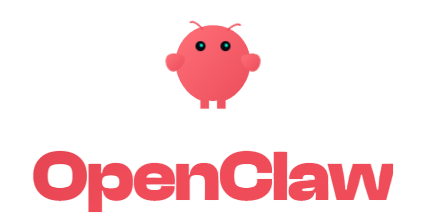

</div>


<div align="center">
Claw thinks. Codex writes. You sleep.
</br>
<em>Claw vibes. Codex codes. You sleep.</em>

<a href="https://openclaw.ai/" target="_blank"></a>
  
[](https://github.com/LongWeihan/taskcaptain/stargazers)
[](https://github.com/LongWeihan/taskcaptain/watchers)
[](https://github.com/LongWeihan/taskcaptain/network)
[](https://deepwiki.com/LongWeihan/taskcaptain)


[中文](./README.md) · [User Guide](./docs/USER_GUIDE.md) · [Deployment](./docs/DEPLOYMENT.md)


</div>


## ⚡ Project Overview
------

**TaskCaptain** is a supervised execution platform built on top of OpenClaw. It changes who is actually "doing the coding": instead of a human manually nudging a chat box over and over, an agent continuously plans, executes, reviews, and advances work inside a real workspace, while the human only needs to define the goal once. By separating user control, Agent supervision, executor implementation, and raw logs into a visible execution chain, TaskCaptain turns a task into a locally inspectable autonomous workflow: **you no longer need to vibe code; OpenClaw can keep driving the task forward for you**.

> You only need to: describe what you want delivered, and adjust the direction in natural language whenever needed</br>
> TaskCaptain returns: a sustainable supervised execution chain, plus a task record that preserves planning, execution, review, and log evidence end to end

### Our Vision

TaskCaptain aims to move AI coding from "chat generation" to "supervised execution". By explicitly separating the responsibilities of humans, supervisor Agents, and implementation executors, it addresses the controllability, visibility, and reliability limits of traditional coding agents:
*   **For engineering practice**: a local command console where long-running tasks, progress review, failure analysis, and mid-task requirement changes all stay inside one transparent loop
*   **For the future of agents**: an early paradigm for agent software engineering, where agents do not merely answer questions but take responsibility for real software work under human supervision

## 📸 Screenshots


<div align="center">
<table>
<tr>
<td>
</td>
<td>
</td>
</tr>
<tr>
<td>
</td>
<td>
</td>
</tr>
</table>
</div>


## 🏭 Demo Projects

### 1. Local Inventory Procurement Console
One prompt:
```
Build a local inventory and procurement console. Make the UI polished. Figure out the rest yourself.
```
<div align="center">
  
</div>

### 2. Optimizing Softmax Performance

Detailed benchmark upload: https://github.com/LongWeihan/softmax-optimization

One prompt:
```
Review the current SOTA softmax optimization variants, design a version that can beat the current SOTA, run it yourself, and provide the comparison results. My machine is 7950x + 128GB + 4060ti 16GB
```
<div align="center">

### Median speedup after aggregation by `N` (candidate vs torch)

|Scenario|N=128|256|512|1024|2048|4096|
| --- | --- | --- | --- | --- | --- | --- |
|`fp16 / none`|0.38x|0.55x|0.27x|1.41x|**2.87x**|1.02x|
|`bf16 / none`|0.39x|0.55x|0.48x|1.40x|**2.39x**|1.03x|
|`fp16 / pad`|0.78x|1.13x|2.00x|3.07x|**3.72x**|2.40x|
|`bf16 / pad`|0.80x|1.18x|2.00x|3.04x|**3.38x**|2.44x|


</div>

### 3. A-share Trading Strategy and Backtesting
One prompt:
```
Design an expert-level A-share trading strategy, and complete backtesting on real historical data. Annualized return should be high, and stability should also be strong enough that I can really make money from it
```
<div align="center">


### Core strategy vs benchmark performance table (2017-2024)

| Dimension | Metric | This Strategy (Expert) | CSI 300 Benchmark |
| --- | --- | --- | --- |
| Capital | Initial Investment | 1,000,000 CNY | 1,000,000 CNY |
|  | Final Balance | 2,334,288 CNY | 1,177,331 CNY |
|  | Net Profit | +1,334,288 CNY | +177,331 CNY |
| Returns | Annualized Return | 11.63% | 2.14% |
| Risk Control | Max Drawdown | -21.08% | -45.60% |
| Risk-adjusted | Sharpe Ratio | 0.79 | 0.11 |


</div>

### 4. llama2.c Project-level Optimization

Detailed benchmark upload: https://github.com/LongWeihan/llama2c-optimization

One prompt:
```
Download this project https://github.com/karpathy/llama2.c, optimize performance, run real tests, and provide comparison results against the original project. My machine is 7950x
```
<div align="center">
  
### Summary results (same model / same prompt / same steps / same thread count)

| run | baseline tok/s | optimized tok/s | speedup |
|---|---:|---:|---:|
| run1 | 132.89 | 603.83 | 4.54x |
| run2 | 133.70 | 622.54 | 4.66x |
| run3 | 133.37 | 617.32 | 4.63x |
| **mean** | **133.32** | **614.56** | **4.61x** |


</div>

> Examples such as one-click forum setup with email registration and more optimization cases are being added...

## Project Architecture
<div align="center">

</div>

## Core Capabilities

### Continuous advancement instead of one-shot answers

TaskCaptain treats a task as a continuous execution flow instead of ending after one reply.

### Clear division between Agent and Codex

- **Agent**: understands the goal, plans steps, supervises progress, and integrates new requirements
- **Codex**: executes inside the work directory, produces deliverables, and reports execution results

### Full visibility for troubleshooting

The interface keeps three layers visible:

- **User ↔ Agent** control dialogue
- **Agent ↔ Codex** execution dialogue
- **Raw logs**

That makes it possible to inspect why a task kept going, why it failed, or where it got stuck.

### Local-first and structurally explicit

Each task has its own:

- configuration
- state
- logs
- Agent profile
- Codex session

State is persisted on disk, which makes inspection, backup, migration, and manual repair straightforward.

---

## Applicable Scenarios

TaskCaptain is a good fit for work that needs:

- AI to keep pushing work forward instead of only answering questions
- long-running development or automation tasks that continue in the background
- complete process retention for review, debugging, or continuation
- reusable Agent identities and stable multi-task workflows
- a Codex workstation where the supervisor and executor are explicitly separated

---

## Product Structure

### Homepage

The homepage provides:

- task list
- Agent profile list
- create new task
- create reusable profile
- bulk delete for non-running tasks

### Task detail page

The task detail page provides:

- configuration details
- User ↔ Agent dialogue area
- Agent ↔ Codex dialogue area
- self-test results
- Agent logs
- Codex logs

### Reusable Agent Profiles

Profiles store default Agent identity and behavior, for example:

- model
- thinking
- soul
- skills
- description

Tasks can inherit a profile and override only the task-specific parts.

---

## Main Features

- local browser UI
- per-task state and log isolation
- reusable Agent profiles
- self-test
- Start / Continue Run
- Stop Run
- append new requirements mid-task
- save current Agent as a reusable profile
- bilingual UI
- no frontend build step

---

## Quick Start

### 1. Clone the repository

```bash
git clone https://github.com/LongWeihan/taskcaptain.git
cd taskcaptain
```

### 2. Launch

```bash
chmod +x run.sh restart.sh
./run.sh
```

Default URL:

```text
http://127.0.0.1:8765
```

### 2.1 Optional: build the Rust fastview helper

This helper is not required.  
TaskCaptain still runs without it.

If you expect large logs or many tasks, building it makes the task page much smoother:

```bash
curl https://sh.rustup.rs -sSf | sh -s -- -y --profile minimal
. "$HOME/.cargo/env"
./build_fastview.sh
```

After it builds successfully, the task detail page shows `Rust fast path`; otherwise it automatically falls back to `Python fallback`.

### 3. Optional: load local environment configuration

```bash
cp .env.example .env
set -a
source .env
set +a
./run.sh
```

---

## First Deployment and Proxy Troubleshooting

### 1. Proxy changes no longer require code edits

Proxy URL, no-proxy list, provider endpoint, and API key are now editable directly in the UI:

- fill in `Proxy URL` / `No Proxy` when creating a task on the homepage
- update and save `Connection Settings` from the task detail page at any time

If your proxy changes from `7890` to `7897`, update the UI or `.env`. You no longer need to patch Python code.

### 2. Recommended usage

- when most tasks share the same proxy: set `PRODUCTS_UI_PROXY` in `.env`
- when only a few tasks need a different proxy: edit `Connection Settings` on that task page
- keep loopback addresses direct: keep `PRODUCTS_UI_NO_PROXY=127.0.0.1,localhost,::1`

### 3. How to interpret Self-Test results

Self-Test now separates failures by layer instead of showing everything as "cannot connect":

- `agent_connection` failed: usually provider endpoint, API key, or proxy configuration
- `product_folder` failed: usually workspace path or permission issues; TaskCaptain creates the directory first
- `acpx_cli` / `codex_agent_bin` / `codex_prompt` failed: usually local executor, Node, ACPX, or Codex environment issues rather than provider API issues

If the API works in Windows but fails inside WSL, check whether the proxy has been configured at the task level or in `.env` before blaming the endpoint itself.

---

## Runtime Requirements

- Linux / WSL2 recommended
- Python 3.10+
- `bash`
- `ss`
- `acpx` installed, or an explicit path via `ACPX_BIN`

---

## Configuration

TaskCaptain supports environment variables for startup behavior.

### Common environment variables

```bash
export PRODUCTS_UI_HOST=127.0.0.1
export PRODUCTS_UI_PORT=8765
export PRODUCTS_UI_DEFAULT_LANG=zh
export PRODUCTS_UI_DEFAULT_OPENAI_BASE_URL=http://127.0.0.1:8317/v1
export PRODUCTS_UI_DEFAULT_CODEX_BASE_URL=http://127.0.0.1:8317/v1
export PRODUCTS_UI_DEFAULT_PRODUCT_FOLDER="$PWD/workspace"
export PRODUCTS_UI_PROXY=
export PRODUCTS_UI_NO_PROXY=127.0.0.1,localhost,::1
export ACPX_BIN=/absolute/path/to/acpx
export TASKCAPTAIN_FASTVIEW_BIN=/absolute/path/to/taskcaptain-fastview
```

### Example

```bash
export PRODUCTS_UI_PORT=8877
export PRODUCTS_UI_DEFAULT_OPENAI_BASE_URL=http://127.0.0.1:8317/v1
./run.sh
```

More deployment details: [docs/DEPLOYMENT.md](./docs/DEPLOYMENT.md)

---

## Run Script Behavior

### `run.sh`

- starts TaskCaptain in the background if the port is free
- if the service is already running, it only prints the current address and log location instead of starting another process

### `restart.sh`

- stops the TaskCaptain process on the current port
- waits for the port to be released
- force kills residual processes when necessary
- clears the log and starts the service again

---

## Structure and UX Improvements in This Version

This version also adds the following practical improvements:

- `product-live` no longer rereads the full log file every 5 seconds; it only tails a recent window, which makes large-log task pages much lighter
- an optional Rust `fastview` helper was added for log tailing and workspace artifact scanning, with automatic Python fallback when it is not installed
- the task detail page now includes:
  - quick runtime signal cards
  - recent artifact list
  - log reading mode hints
  - tab memory
  - artifact path copy buttons
- the `Agent ↔ Codex` dialogue now shows a cleaned final Codex reply, while raw tool / thinking traces stay in the log panels

---

## Directory Structure

```text
taskcaptain/
├── app/
│   └── server.py
├── data/
│   ├── claw-profiles/
│   ├── products/
│   └── trash/
├── docs/
│   ├── ARCHITECTURE.md
│   ├── DATA_MODEL.md
│   ├── DEPLOYMENT.md
│   └── USER_GUIDE.md
├── logs/
├── runs/
├── workspace/
├── .env.example
├── .gitignore
├── CONTRIBUTING.md
├── LICENSE
├── Makefile
├── README.md
├── README-EN.md
├── SECURITY.md
├── hero.png
├── restart.sh
└── run.sh
```

---

## Documentation

- [Chinese README](./README.md)
- [User Guide](./docs/USER_GUIDE.md)
- [Deployment](./docs/DEPLOYMENT.md)
- [Architecture](./docs/ARCHITECTURE.md)
- [Data Model](./docs/DATA_MODEL.md)
- [Contributing](./CONTRIBUTING.md)
- [Security](./SECURITY.md)

---

## Security Notes

TaskCaptain is currently positioned as a **local console for trusted local environments**.

The repository does not currently include:

- multi-user authentication
- permission isolation
- public-internet access control

If you need remote access, deploy it behind a reverse proxy and add your own:

- authentication
- HTTPS
- IP restrictions
- least-privilege runtime policy

Detailed guidance: [SECURITY.md](./SECURITY.md)

---

## Open Source and Conventions

- License: [MIT](./LICENSE)
- Contributing: [CONTRIBUTING.md](./CONTRIBUTING.md)
- Security: [SECURITY.md](./SECURITY.md)

---

## License

This project is licensed under the [MIT License](./LICENSE).

## 📄 Acknowledgments
- Thanks to Peter Steinberger, founder of OpenClaw, for the recognition and valuable feedback on this project (quote: cool stuff!)
- TaskCaptain has received strategic support and incubation from Ramen Group. We sincerely thank Ramen for the technical support.

## 📈 Project Stats
<a href="https://star-history.com/#LongWeihan/taskcaptain&type=date">
  <picture>
    <source
      media="(prefers-color-scheme: dark)"
      srcset="https://api.star-history.com/svg?repos=LongWeihan/taskcaptain&type=date&theme=dark&v=20260312"
    />
    <source
      media="(prefers-color-scheme: light)"
      srcset="https://api.star-history.com/svg?repos=LongWeihan/taskcaptain&type=date&v=20260312"
    />
    
  </picture>
</a>
